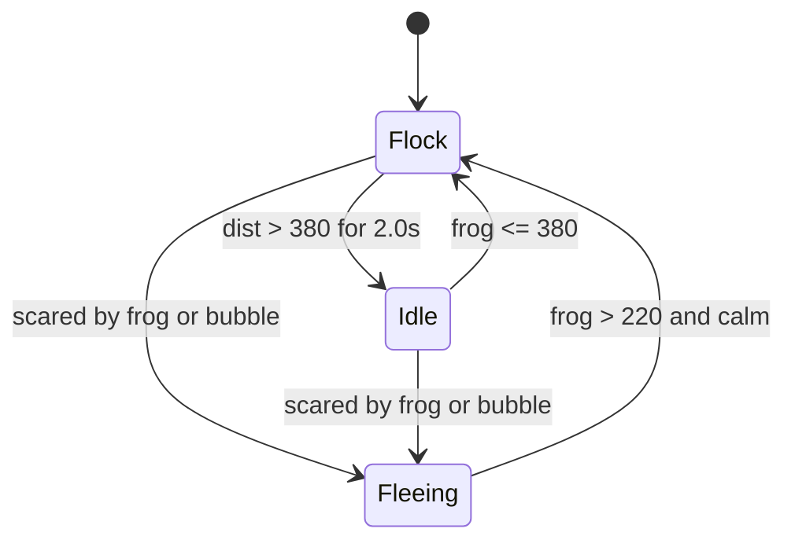
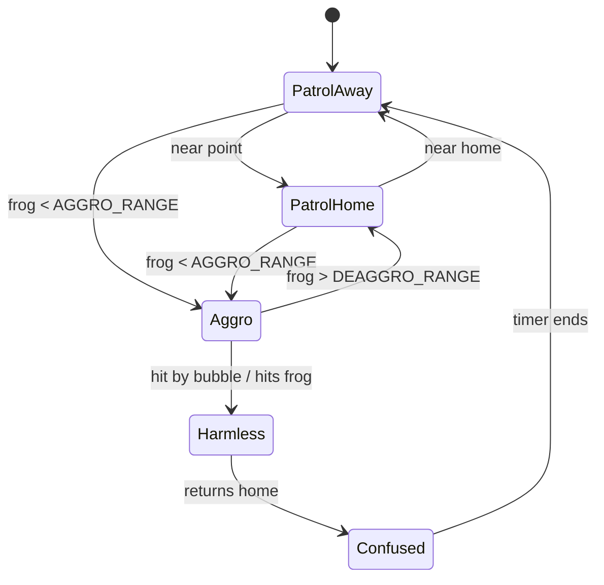

# Marking Rubric Map

| Rubric Bullet | File | Function/Line | How it's satisfied |
|---|---|---|---|
| **Steering 6 pts** | | | |
| Seek, Flee, Arrive | `steering.py` | `seek()`, `flee()`, `arrive()` | Core steering mechanisms implemented; `arrive` leverages distance-based braking and proportional logic. |
| Pursue and Evade | `steering.py` | `pursue()`, `evade()` | Future interception targets predicted dynamically based on entity velocity and speed horizons. |
| Wander | `steering.py` | `wander_force()` | Implements jitter offset circle calculations. Wired into the `Idle` fly state and `Confused` snake state. |
| Boids Flocking | `steering.py`, `entities/fly.py`, `main.py` | `boids_cohesion`, `boids_separation`, `reset()` | Implements standard blend weights with Arrive-like dead-zone smoothing targeting the flock core. Additionally, clustered spatial spawning and a localized straggler-`seek()` fallback ensure robust behavior under pressure. |
| Obstacle Avoidance | `steering.py` | `seek_with_avoid()` | Circlecast raycasting averts collisions using tuple payloads for hysteresis path sticking. |
| Velocity Integration | `steering.py` | `integrate_velocity()` | Euler integration accurately integrates forces and enforces optimal speed caps continuously. |
| **FSMs 4 pts** | | | |
| Fly State Machine | `entities/fly.py` | `update()` | 3-State FSM distinguishing between `Flock`, `Fleeing`, and `Idle` via threshold triggers leveraging `BubbleFleeRange`. |
| Snake State Machine | `entities/snake.py` | `update()` | 5-State FSM (`PatrolAway`, `PatrolHome`, `Aggro`, `Harmless`, `Confused`) routing aggressive engagement and cyclic guarding. |
| FSM Logic Completeness | `entities/snake.py` | `set_state()` | Safe timers and conditional distances safely prevent locking loops. |
| State Visualization | `entities/snake.py` | `draw()` | F1 overlay draws string literal states over agents while bodies independently map distinct dynamic colors to states. |
| **Advanced Extensions 10 pts** | | | |
| Clustered Spawning | `main.py` | `reset()` | Densities grouped during `reset()` spawn calculations, accelerating initial herd locking. |
| Dynamic Obstacle Avoidance Priority | `entities/snake.py` | `update()` | Dynamically raises the blend weight of collision avoidance scaling natively up to `0.65` near obstacles. |
| Stickiness Hysteresis | `steering.py` | `seek_with_avoid()` | Tuple returns recall favorable paths enforcing directional momentum over frame-to-frame recalculations preventing jitter. |
| Physics Impact Bubbles | `entities/frog.py` | `shoot()` | Frogs fire fast-moving pacification bubbles triggering reactive defensive logic from aggressor networks. |
| Developer Sliders | `main.py` | `Slider()` | Enables live, real-time alterations to Separation, Cohesion, Alignment ranges removing constant console restarts. |

## Fly State Machine

## Snake State Machine

